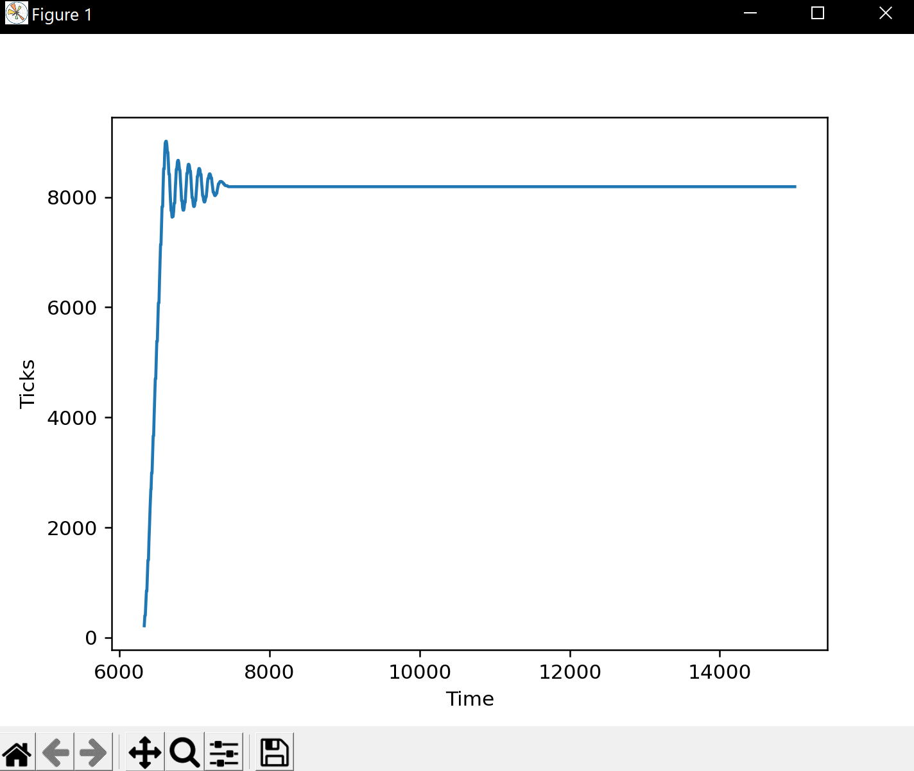
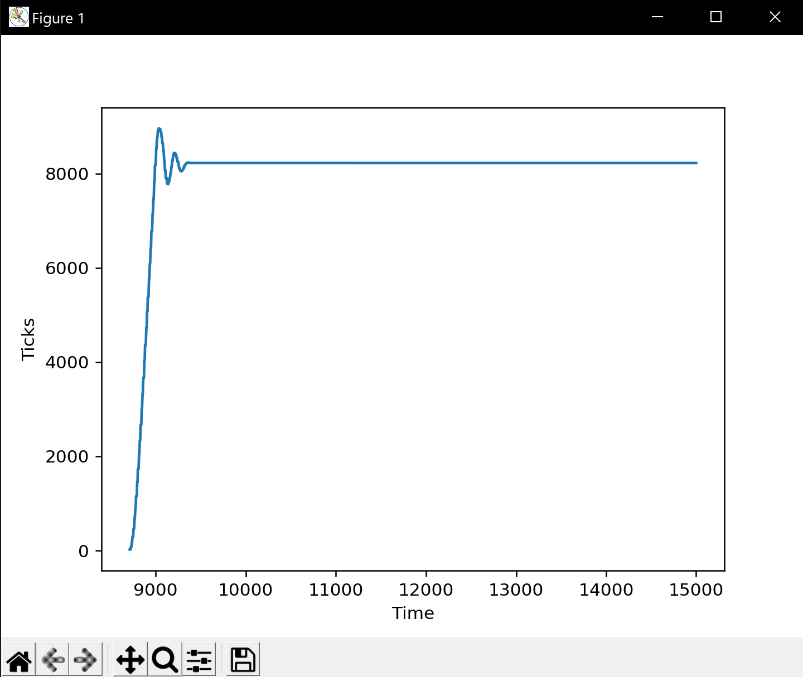

## ME 405 Lab 3 Readme

Program by Luke Sandsor, Jack Barone, Jackson Meyers

#### Running the Example

First, we downloaded and read through the provided Task and example code to understand how the Task system works and to understand what the example code did.
Then we loaded the example onto the Nucleo board and observed the behavior in the serial terminal. 
Everything worked correctly and we noticed that the tasks would print 3 items, 4 items, and 4 items, then repeat the pattern.
We summised that this was due to the periods of the two tasks and how they overlapped.

#### Writing our Program

We started by drawing a task diagram for the program. We assigned the highest priority to the encoder as it will have the smallest period.
Our controller and motor were at the second level of priority and decided to use a period of 10ms for both of these.

We created our three core tasks in the code. 
We wrote 2 simple generators for the encoder and motor to put the values from the encoder into a Share and pull the motor duty cycle from a Share.
The controller task used the function from our Lab 2, with some modifications to get the encoder value from the encoder Share and to put the resulting duty cycle to the motor Share.

#### Testing with One Motor

Our first test successfully ran the motor, but we had to debug as the settling time was too long. 
We decreased the period of the encoder to 10ms and found that the motor behaved as expected. 
Then we slowed the the period of the motor and controller until the system not longer worked. 
We found that the motor and controller worked at periods of 7ms and smaller. 8ms and above caused the system to be unstable.

Once that was working, we modified the controller task to output to the serial terminal so we could record and graph the data.

##### Step Response 7ms Period

##### Step Response 1ms Period

#### Testing with Two Motors

We connected a second motor and created a second set of tasks to run it. 
We used the encoderDriver and motorDriver classes we wrote for Lab 1 to quickly set up the second motor and encoder on a different timer.

The 2 motor set up worked correctly on our first try and we tested by changing the period of the motors.

#### Discussion

When one of the motor tasks was run too slowly, it became unstable. 
Because the two motors were at the same priority and separated into tasks, the one unstable motor did not block the correctly tuned motor. 
We found experimetally that **1ms** was the ideal speed for running the motor tasks. As seen in the step response plots, the 1ms period response settles much faster and has minimal extra overshoot.

##### Step Response 7ms Period

##### Step Response 1ms Period

